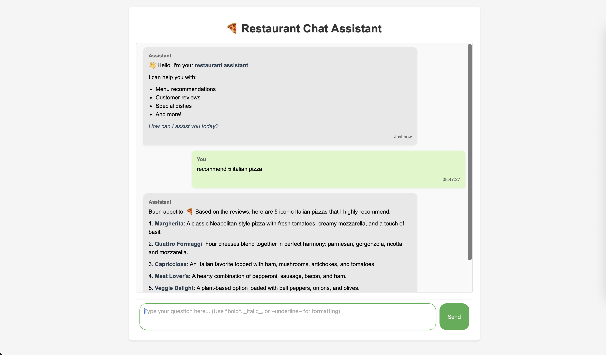

# Restaurant Chat Assistant with RAG

A conversational AI assistant for restaurant information using Retrieval-Augmented Generation (RAG) with LangChain and FastAPI. This application provides an interactive chat interface where users can ask questions about the restaurant, and the AI responds based on relevant restaurant reviews and conversation context.



## Features

- 🤖 **Intelligent Chat Interface**: Interactive chat UI with support for conversation history
- 📝 **Rich Text Formatting**: Support for markdown-style formatting including:
  - Bold text (`**text**`)
  - Italic text (`*text*`)
  - Underline text (`~text~`)
  - Code blocks (`` `code` ``)
  - Lists and blockquotes
- 🔍 **Context-Aware Responses**: Uses RAG to provide accurate answers based on restaurant reviews
- 💬 **Conversation History**: Maintains chat context for more coherent interactions
- 🎨 **Modern UI/UX**: Clean, responsive design with visual feedback and animations

## Technology Stack

- **Backend**:
  - FastAPI (Web Framework)
  - LangChain (RAG Implementation)
  - Ollama (Language Model)
  - ChromaDB (Vector Store)
- **Frontend**:
  - HTML5
  - CSS3
  - JavaScript (Vanilla)

## Prerequisites

- Python 3.8+
- Ollama with Llama model installed
- Git

## Installation

1. Create and activate a virtual environment:

For macOS/Linux:
```bash
# Create a new virtual environment
python -m venv venv

# Activate the virtual environment
source venv/bin/activate
cd venv
```

For Windows:
```bash
# Create a new virtual environment
python -m venv venv

# Activate the virtual environment
.\venv\Scripts\activate
```

You'll know the virtual environment is activated when you see `(venv)` in your terminal prompt.

2. Clone the repository:
```bash
git clone https://github.com/yourusername/simple-rag-restaurant.git
cd simple-rag-restaurant
```

3. Install required Python packages:
```bash
pip install fastapi uvicorn langchain-ollama chromadb
```

4. Make sure Ollama is running with the required model:
```bash
ollama run hf.co/bartowski/Llama-3.2-1B-Instruct-GGUF:latest
```

## Project Structure

```
simple-rag-restaurant/
├── main.py                 # FastAPI application
├── vector.py              # Vector store setup and retrieval
├── index.html             # Frontend chat interface
├── realistic_restaurant_reviews.csv  # Sample restaurant reviews
└── chroma_langchain_db/   # Vector database storage
```

## Usage

1. Make sure your virtual environment is activated. You should see `(venv)` in your terminal prompt. If not, activate it using the commands from step 2 of the installation instructions.

2. Start the FastAPI server:
```bash
uvicorn main:app --reload --host 0.0.0.0 --port 8000
```

3. Open your web browser and navigate to:
```
http://localhost:8000
```

4. Start chatting with the AI assistant! You can ask questions about:
- Menu recommendations
- Customer reviews
- Special dishes
- Restaurant information
- And more!

## Example Interactions

```
User: What are your most popular dishes?
Assistant: Based on our customer reviews, our most popular dishes include our signature pepperoni pizza, margherita pizza with fresh basil, and our special four-cheese pizza. Many customers particularly praise our homemade tomato sauce and crispy crust.

User: Tell me about your vegetarian options.
Assistant: We offer several delicious vegetarian options! Our menu includes...
```

## Contributing

Contributions are welcome! Please feel free to submit a Pull Request.

1. Fork the repository
2. Create your feature branch (`git checkout -b feature/AmazingFeature`)
3. Commit your changes (`git commit -m 'Add some AmazingFeature'`)
4. Push to the branch (`git push origin feature/AmazingFeature`)
5. Open a Pull Request

## License

This project is licensed under the MIT License - see the [LICENSE](LICENSE) file for details.

## Acknowledgments

- Thanks to all contributors who have helped shape this project
- Restaurant reviews dataset contributors
- LangChain and FastAPI communities

## Contact

Your Name - [@yourtwitter](https://twitter.com/yourtwitter)

Project Link: [https://github.com/yourusername/simple-rag-restaurant](https://github.com/yourusername/simple-rag-restaurant)

## Troubleshooting

- If you see an error about missing dependencies, make sure your virtual environment is activated and all packages are installed.
- To deactivate the virtual environment when you're done, simply run:
  ```bash
  deactivate
  ``` 